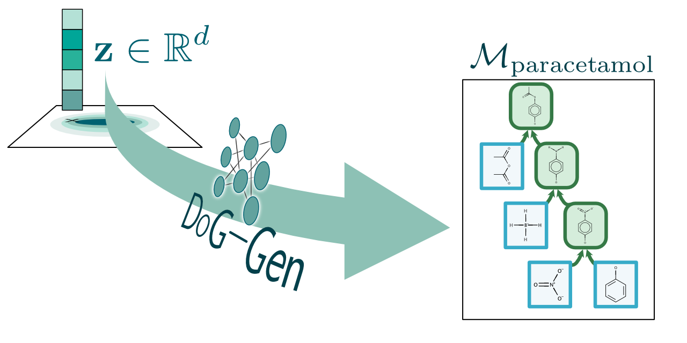
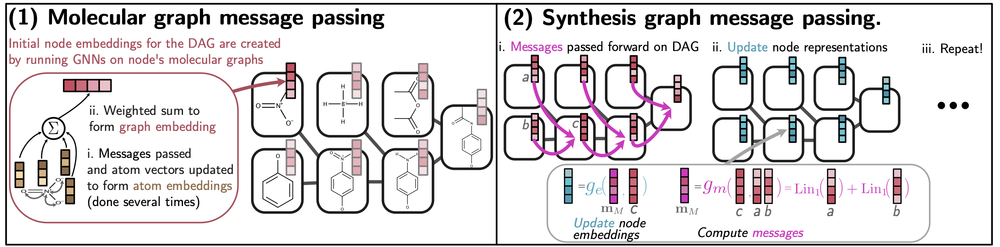
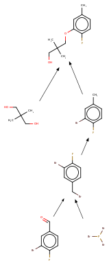

# Barking up the right tree: an approach to search over molecule synthesis DAGs

Core code for the paper "Barking up the right tree: an approach to search over molecule synthesis DAGs"
 by John Bradshaw, Brooks Paige, Matt J. Kusner, Marwin H. S. Segler, José Miguel Hernández-Lobato (https://arxiv.org/abs/2012.11522).
 Updated to use PyTorch 1.4, Python 3.7.
 
 NB this repo makes use of Git submodules.
 
 

 ## Installation
For running this code we will detail two installation methods: (1) via Conda yml files for installation locally,
(2) via Docker. Installation requires the setting up of two Python environments, the first for running our code and the 
second for running the Molecular Transformer<sup>[1](#refMolTran)</sup>. These two run on separate environments as they use different
versions of PyTorch. We run the Molecular Transformer in server mode such that we can query it whenever we need a new
reaction predicting.

 
 ### Installation via Conda

This route requires the [Conda package manager](https://docs.conda.io/en/latest/) and involves installing the Python packages locally.
If you do not have Conda already (e.g. through [Anaconda](https://www.anaconda.com/products/individual)) then install this first.
Then perform the following steps:


1. Install the requirements of this repo:  
    a. Clone or download this repo's code and navigate to its directory.  
    b. Install the conda environment: `conda env create -f conda_dogae_gpu.yml`  
    c. Activate it: `conda activate dogae_py3.7_pt1.4`  
    d. Make sure you have cloned the submodules of this repo, i.e. `git submodule init` and `git submodule update`  
    e. Add the relevant paths to the `PYTHONPATH` environment variable, e.g. `source set_up.sh`  
2. Setup the Molecular Transformer<sup>[1](#refMolTran)</sup> as a server using [Schwaller et al.'s code](https://github.com/pschwllr/MolecularTransformer):  
    a. Open up a new shell (leave the old one open -- we will come back to it in step 3).
    b. In this new shell clone the Transformer repo somewhere, e.g. `git clone git@github.com:pschwllr/MolecularTransformer.git`  
    c. Install the relevant Python packages via installing an appropriate Conda environment, e.g. `conda env create -f conda_mtransformer_gpu.yml`   
    d. Activate the conda environment, e.g. `conda activate mtransformer_py3.6_pt0.4` (if you download the conda environment from this repo) 
    e. Add the weights to the Transformer directory (wherever you cloned it) inside a `saved_models` subdirectory. These weights
    can be downloaded from    
     [Google Drive](https://drive.google.com/file/d/1ogXzAg71BOs9SBrVt-umgcdc1_0ijUvU/view?usp=sharing):  
         ```shasum -a 256 molecular_transformer_weights.pt
        ## returns 93199b61da0a0f864e1d37a8a80a44f0ca9455645e291692e89d5405e786b450  molecular_transformer_weights.pt```  
     f. Inside the `available_models` subdirectory of the Transformer repo copy the `misc/mtransformer_example_server.conf.json` 
     file from this repo (you can change these parameters as you wish) into the Molecular Transformer repo.  
     g. From the top level of the Transformer repo start the server, with e.g. `CUDA_VISIBLE_DEVICES="0,1" python server.py --config available_models/mtransformer_example_server.conf.json`  
        (this is where you can choose which GPUs on your machine you want to use so edit the `CUDA_VISIBLE_DEVICES` variable appropriately).

    I assume you're running the Transformer on the same machine as our code, if not you'll want to edit 
    `synthesis-dags-config.ini` such that our code can find the Transformer server.
    Now just leave this server running in this shell and the code in this repo will communicate with it when necessary.   
3. Back in the shell which you were using in step 1, unzip the `uspto.zip` folder in this repo<sup>[†](#refDagger)</sup>  
and in `scripts/dataset_creation/data.zip`.
4. (optional) You may want to test that the installation worked by running our unittests under `testing` (these use `pytest`).
It's also probably a good idea to check that the Transformer is working by running the script `functional_tests/reaction_predictor_server_checker.py`
and checking that it returns a sensible result.

NB These installation instructions are for a machine with a GPU but much of the code should also run on a cpu (albeit more slowly) -- 
just modify the yml files to not install CUDA libraries.


 <a name="refDagger">†</a> The `uspto.zip` file is optional and depends if you wish to create a synthesis DAG dataset
  yourself. This data in this zip is the processed USPTO reaction data provided in
   [here](https://github.com/wengong-jin/nips17-rexgen) <sup>[2](#refWLReact)</sup>.
 
 ### Running via Docker
This route involves using a Docker container [Docker](https://www.docker.com/) to run the code, taking advantage of the 
[NVIDIA container toolkit](https://github.com/NVIDIA/nvidia-docker) to use the GPUs. 
The rest of the instructions assume that you have these tools installed.

You can then construct the Docker image yourself after cloning this repo, e.g. via `docker build . -t synthesis-dags`, 
although remember to install the submodules first. 
Alternatively, you can use our pre-built Dockerfile hosted on [Docker Hub](https://hub.docker.com/repository/docker/johnbradshaw/synthesis-dags) 
To run a Docker container using the built image you can run a command along the lines of:  
`docker run -it --gpus all --shm-size 2G synthesis-dags /bin/bash`   
Once inside, depending on what you want to do, you may need to: (i) activate the required conda environment(s), (ii) add the
 required paths to your PYTHONPATH variable, and (iii) start the Transformer. 
If you wish you can use `source docker_set_up.sh` to automate this process. 
 
Please refer to the [Docker documentation](https://docs.docker.com/engine/reference/commandline/cli/) for details on 
 how to mount volumes or expose ports when running this command. Note also that this requires that you are running on
 a machine with at least one GPU.
 
 ## Scripts
 
 ### Dataset Creation
 * `scripts/dataset_creation/create_datasets.py`: this script will (from USPTO reaction data) produce a dataset of synthesis
DAGs. It carries out the process described in the appendix of our paper (ie builds up a reaction network and then works
backwards to create a DAG for each product). The resulting datasets are produced in `scripts/dataset_creation/data`. 
I have added the output of this folder as a zip to this repo so you do not need to rerun.
 
 ### DoG-AE
 * Training: `scripts/dogae/train/train_dogae.py`
* Sampling: `scripts/dogae/prior_sampling/sample_from_prior.py`
* Interpolating (via random walk): `scripts/dogae/walks/walk_in_latent_space.py`
 
 ### DoG-Gen
 * Training: `scripts/dog_gen/train_dog_gen.py`
* Sampling: `scripts/dog_gen/sample_from_model.py`
* Hillclimbing/Finetuning (i.e. optimization): `scripts/dog_gen/run_hillclimbing.py`
 
 ### Misc
 * `scripts/viz/plot_tuple_tree.py` can be used for plotting synthesis DAGs (in a tree representation). This code 
outputs a webpage which displays the tree.
  
 
 ## Model Code
 
 In this section we briefly describe where some key parts of the model code live.
 

 ### Generative model of DoGs (DAGs of Graphs)!
 Our generative model of DAGs is in `syn_dags/model/dog_decoder.py` (the rough architecture of this model is shown below).
  The main class is `DOGGenerator`,  with the methods `nlog_like_of_obs` and `_run_forward_via_sampling` doing most of the heavy lifting. 
These are written to operate in minibatch mode by packing the different sequences together. 
Indices are used to send the various context vectors to the correct action network head. 
 
 
 
 ### Encoder
 The encoder consists of two stages of message passing:  
 
 
 The code doing the second stage is in `syn_dags/model/dag_embedder.py`, this expects the node representations to already
 be those computer by the 1st GNN. The GNN implementation is in the submodule `submodules/GNN`. 
 
 ### Reaction Prediction
 The reaction predictor we use is the Molecular Transformer<sup>[1](#refMolTran)</sup>, and as discussed in the introduction above 
 we use Schwaller et al.'s code for this model, running this in server mode. The code for calling the server in this codebase is
 in `syn_dags/model/reaction_predictors.py`. The `OpenNMTServerPredictor` class contains the logic for calling the server and for choosing
 a reactant randomly if the reaction oracle does not return successfully. If you wanted to use an alternative reaction predictor then you
 probably want to wrap it in a subclass of `AbstractReactionPredictor` (also in `syn_dags/model/reaction_predictors.py`).
 
### Dataloader 
 
 The dataloader code is in `syn_dags/data/synthesis_trees.py`. The class for storing synthesis DAGs is `SynthesisTree`
(the DAG is referred to a tree in the class name as at this point as this class stores the data in the tree 
formalism described in our appendix). 
This class serializes the DAG and computes all the features for training the model on the whole sequence at once in the method
`get_features_required_for_training_model`. The class makes use of a datastructure we call a tuple_tree in our code.
This is a way of storing the DAGs using inbuilt Python datatypes, so for instance the code here:  
`tuple_tree = ('Cc1ccc(F)c(OCC(C)(C)CO)c1', [('CC(C)(CO)CO', []), ('Cc1ccc(F)c(Br)c1', [('Fc1ccc(CBr)cc1Br', [('O=Cc1ccc(F)c(Br)c1', []), ('BrP(Br)Br', [])])])])`,   
represents the synthesis DAG:   
   
In other words, the first element in a tuple represents the SMILES associated with each node in our DAG 
with the second element containing a list detailing this nodes' parents (i.e. reactants).
 
### Optimization
See `syn_dags/script_utils/opt_utils.py` for the optimization task code. If you want to use the model to optimize
for a new property define it here.
 
 
 ## References
 <a name="refMolTran">[1]</a>
Schwaller, P., Laino, T., Gaudin, T., Bolgar, P., Hunter, C.A., Bekas, C. and Lee, A.A., 2019. 
 Molecular Transformer: A Model for Uncertainty-Calibrated Chemical Reaction Prediction.
  ACS Central Science.
  
<a name="refWLReact">[2]</a>
  Jin, W., Coley, C., Barzilay, R. and Jaakkola, T., 2017. Predicting organic reaction outcomes with Weisfeiler-Lehman network. In Advances in Neural Information Processing Systems (pp. 2607-2616).


 
