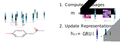
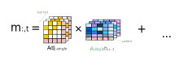
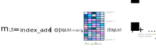
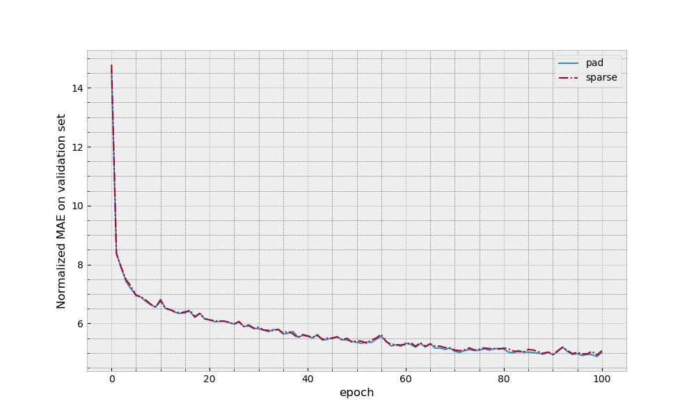

# GNN: Graph Neural Networks

Playground for me to explore different patterns of doing Gated Graph Neural Networks (Li et al., 2015; Gilmer et al., 2017).
So far the code in this library is mostly just an incomplete PyTorch port of some of the methods in
 https://github.com/Microsoft/gated-graph-neural-network-samples.
We are only interested in running these networks on small graphs (eg representing organic chemical molecules), for which
we expect to be able to fit multiple graphs in each minibatch. 
If you're looking for a full featured GNN libary in PyTorch you may want to check out [PyTorch Gometric](https://github.com/rusty1s/pytorch_geometric).

## Installation

* **PyTorch:**
We're now using Version 1.3
* pytest for testing
*  Pytorch Scatter https://github.com/rusty1s/pytorch_scatter  -- added this to be able to do sparse attention.

## Notation
We will stick to using this notation whilst documenting our code.

### Core  
`b` the batch size  
`e` the number of edge types  
`v` the number of nodes for adjacency matrix in one graph
`v*` the number of stacked active nodes in all the graphs  
`E*` the number of edges in all the graphs
`h` the dimension of the node representation    
`[...]` corresponding array/tensor shape. eg `[2,4]` signifies a 2 by 4 matrix

## Patterns

We have various ways of representing graphs, eg adjacency matrices, edge lists etc.
This can affect how we put multiple graphs together in one batch.
Here we go through two different patterns for implementing GGNs. 

### Pad Pattern

Standard implementation as seen elsewhere, eg https://github.com/Microsoft/gated-graph-neural-network-samples.  
Takes in adjacency matrices and node features. Achieves parallelism via padding the these with zeros such that all the
graphs have the same number of nodes.

### Sparse Pattern
Think this matches the sparse pattern eg at https://github.com/Microsoft/gated-graph-neural-network-samples.  

Nodes features are stacked up together to form one matrix.
The edges are represented by a stacked adjacency list structure.

## Examples 

### QM9 Dataset

Here we replicate the setup of regressing for mu in QM9 dataset (the task in Gilmer et al.).
The setup and dataset is taken from https://github.com/Microsoft/gated-graph-neural-network-samples.
Note we do not expect to replicate the results of Gilmer et al as we do not match hyperparameters or even use the same 
underlying features.

Times of the different methods (for one forward pass through the validation dataset with K80 GPU).
Note that we can possibly speed this up further, eg for the stack method in particular much of the initial pre-compute/
pre-processing of the graphs could be done ahead of time if we increased the number of parallel workers.

| Variant       | Time (s)      |
| ------------- | ------------- |
| Pad           | 5.7           |
| Sparse        | 4.1           |

## TODOs
* consider using `TORCH.SPARSE` as an alternative way to do a padded pattern 
* consider doing padded pattern but make adjacency matrix hold all graphs -- probably only makes sense when switch to
sparse methods.
* dropout
* weighted attention
* global node (see Gilmer et al.)
* edge biases

## Refs

  Li, Y., Tarlow, D., Brockschmidt, M. and Zemel, R., 2015. Gated graph sequence neural networks.
  ICLR 2016

  Gilmer, J., Schoenholz, S.S., Riley, P.F., Vinyals, O. and Dahl, G.E., 2017.
  Neural message passing for quantum chemistry. ICML 2017

  Veličković, P., Cucurull, G., Casanova, A., Romero, A., Lio, P. and Bengio, Y., 2017. 
  Graph attention networks. ICLR 2018
  
  