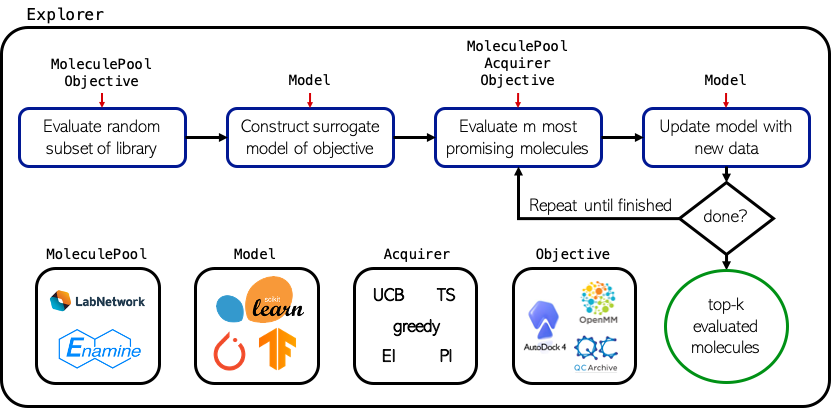

# MolPAL: Molecular Pool-based Active Learning
# Efficient Exploration of Virtual Chemical <br/> Libraries through Active Learning



## Overview
This repository contains the source of MolPAL, a software for the accelerated discovery of compounds in high-throughput virtual screening environments, as originally detailed in the paper [Accelerating high-throughput virtual screening through molecular pool-based active learning](https://pubs.rsc.org/en/content/articlelanding/2021/sc/d0sc06805e).

## Table of Contents
- [Overview](#overview)
- [Table of Contents](#table-of-contents)
- [Requirements](#requirements)
- [Installation](#installation)
- [Running MolPAL](#running-molpal)
  * [Setting up a ray cluster](#setting-up-a-ray-cluster)
  * [Preprocessing](#preprocessing)
  * [Configuration files](#configuration-files)
  * [Examples](#examples)
  * [Required Settings](#required-settings)
  * [Optional Settings](#optional-settings)
- [Object Model](#object-model)
- [Future Directions](#future-directions)
- [Reproducing Experimental Results](#reproducing-experimental-results)
- [Citation](#citation)

## Requirements
- Python (>= 3.6)

_if utilizing GPU accelerated model training and inference_
- CUDA (>= 10.2)
_if utilizing distributed GPU accelerated model training and inference_
- CUDA (>= 11.1)

_if performing docking online_
- the appropriate requirements as listed in the `pyscreener` [README](https://github.com/coleygroup/pyscreener)

## Installation
The first step in installing MolPAL is to clone this repository: `git clone <this_repo>`

The easiest way to install all dependencies is to use conda along with the supplied [environment.yml](environment.yml) file, but you may also install them manually, if desired. All libraries listed in that file are __required__ before using `MolPAL`

The following packages are _optional_ to install before running MolPAL:
- cudatoolkit: whichever version matches your CUDA build if utilizing GPU acceleration for PyTorch-based models (MPN)
- [map4](https://github.com/reymond-group/map4) and [tmap](https://github.com/reymond-group/tmap): if utilizing the map4 fingerprint
- [optuna](https://optuna.readthedocs.io/en/stable/installation.html): if planning to perform hyperparameter optimization
- matplotlib: to generate plots from the publication
- seaborn: to generate plots from the publication

#### setup via conda
__NOTE__: the `environment.yml` must be edited to reflect your machine's setup. To do this, uncomment out the appropriate line depending on your CUDA version or if you lack a GPU entirely. If you need a lower CUDA version than those specified in the environment YAML file, comment out the PyTorch line as well and go to the [pytorch wesbite](https://pytorch.org/get-started/locally/) to set the channels and versions of both the pytorch and cudatoolkit packages properly.

0. (if necessary) [install conda](https://docs.conda.io/projects/conda/en/latest/user-guide/install/)
1. `cd /path/to/molpal`
1. `conda env create -f environment.yml`

Before running MolPAL, be sure to first activate the environment: `conda activate molpal`

## Running MolPAL

### Setting up a ray cluster
MolPAL parallelizes objective function calculation and model inference (training coming later) using the [`ray`](ray.io) library. MolPAL will automatically start a ray cluster if none exists, but this is highly limiting because it can't leverage distributed resources nor will it accurately reflect allocated resources (i.e, it will think you have access to all N cores on a cluster node, regardless of your allocation.) 

_Ex._: To specify a local ray cluster with all the resources on your machine, type:
`ray start --head`

_Ex._: To restrict the ray cluster to using only N CPUs and M GPUs, type:
`ray start --head --num-cpus N --num-gpus M`

To properly leverage multi-node allocations, you must set up a ray cluster manually before running MolPAL. The [documentation](https://docs.ray.io/en/master/cluster/index.html) has several examples of how to set up a ray cluster, and the only thing specific to MolPAL is the reliance on two environment variables: `redis_password` and `ip_head`. MolPAL will use the values of these environment variables to connect to the proper ray cluster. An example of this may be seen in the SLURM submission script [`run_molpal.batch`](run_molpal.batch)

#### GPU usage
MolPAL will automatically use a GPU if it detects one in the ray cluster. If this is undesired, you can specify `--num-gpus 0` when starting ray and running `export CUDA_VISIBLE_DEVICES=''` before starting MolPAL

### Preprocessing
For models expecting vectors as inputs (e.g., random forest and feed-forward neural network models,) molecular fingerprints must be calculated first. Given that the set of fingerprints used for inference is the same each time, it makes sense to cache these fingerprints, and that's exactly what the base `MoleculePool` (also referred to as an `EagerMoleculePool`) does. However, the complete set of fingerprints for most libraries would be too large to cache entirely in memory on most systems, so we instead store them on disk in an HDF5 file that is transparently prepared for the user during MolPAL startup (if not already provided with the `--fps` option.)

If you wish to prepare this file ahead of time, you can use [`scripts/fingerprints.py`](scripts/fingerprints.py) to do just this. While this process can be parallelized over an infinitely large ray cluster (see [above](#setting-up-a-ray-cluster),) we found this was I/O limited above 12 cores, which takes about 4 hours to prepare an HDF5 file of 100M fingerprints. __Note__: if MolPAL prepares the file for you, it prints a message saying where the file was written to (usually under the $TMP directory) and whether there were invalid SMILES. To reuse this fingerprints file, simply move this file to a persistent directory after MolPAL has completed its run. Additionally, it will tell you which lines in your library file were invalid. You should use this value for the `--invalid-idxs` argument to further speed up MolPAL startup.

_Ex._: To prepare the fingerprints file corresopnding to the sample command below, issue the following command:

`python scripts/fingerprints.py --library libraries/Enamine50k.csv.gz --fingerprint pair --length 2048 --radius 2 --name libraries/fps_enamine50k`

The resulting fingerprint file will be located in your current working directory as `libraries/fps_enamine50k.h5`. To use this in the sample command below, add `--fps libraries/fps_enamine50k.h5` to the argument list.

### Configuration files
The general command to run MolPAL is as follows:

`python molpal.py -o {LOOKUP,DOCKING} --objective-config <path/to/objective_config> --libary <path/to/library.csv[.gz]> [additional library arguments] [additional model/encoding/acquistion/stopping/logging arguments]`

Alternatively, you may use a configuration file to run MolPAL, like so:

`python molpal.py --config <path/to/config_file>`

Two sample configuration files are provided: [minimal_config.ini](examples/config/minimal_config.ini), a configuration file specifying only the necessary arguments to run MolPAL, and [sample_config.ini](examples/config/sample_config.ini), a configuration file containing a few common options to specify (but not _all_ possible options.)

Configuration files accept the following syntaxes:
- `--arg value` (argparse)
- `arg: value` (YAML)
- `arg = value` (INI)
- `arg value`

### Examples
A sample command to run one of the experiments used to generate data in the initial publication is as follows:

`python run.py --config expt-configs/Enamine50k_retrain.ini --name molpal_50k --metric greedy --init-size 0.01 --batch-sizes 0.01 --model rf`

or the full command:

`python run.py --name molpal_50k --write-intermediate --write-final --retrain-from-scratch --library libraries/Enamine50k.csv.gz --validated --metric greedy --init-size 0.01 --batch-sizes 0.01 --model rf --fingerprint pair --length 2048 --radius 2 --objective lookup --objective-config objective-configs/Enamine50k_lookup.ini --top-k 0.01 --window-size 10 --delta 0.01 --max-iters 5`

### Required Settings
The primary purpose of MolPAL is to accelerate virtual screens in a prospective manner. Currently (December 2020), MolPAL supports computational docking screens using the [`pyscreener`](https://github.com/coleygroup/pyscreener) library

`-o` or `--objective`: The objective function you would like to use. Choices include `docking` for docking objectives and `lookup` for lookup objectives and this dictates the options that must be specified in the `objective-config` file:
- `docking`: please see the 
- `lookup`
  * `--lookup-path`: the filepath of a CSV file containing score information for each input

`--libraries`: the filepaths of CSV files containing the virtual library as SMILES (or CXSMILES) strings. If CXSMILES, pass the additional `--cxsmiles` flag

### Optional Settings
- `--fps`: the filepath of an hdf5 file containing the precomputed fingerprints of your virtual library. MolPAL relies on the assumption that the ordering of the fingerprints in this file is exactly the same as that of the library file and that the encoder used to generate these fingerprints is exactly the same as the one used for model training. MolPAL handles writing this file for you if unspecified, so this option is mostly useful for avoiding the overhead at startup of running MolPAL again with the same library/featurizer settings.
- `--invalid-idxs`: unless MolPAl prepares your fingerprints file for you, it must validate each SMILES string in the library and determine the set of invalid indices in the virtual library. This can be time-consuming for large virtual libraries, so passing this set to MolPAL, if known, can save time. Preparing the fingerprints file as in the [Preprocessing](#preprocessing) section will output this set for you.

MolPAL also has a number of different model architectures, encodings, acquisition metrics, and stopping criteria to choose from. Many of these choices have default settings that were arrived at through hyperparameter optimization, but your circumstances may call for modifying these choices. To see the full list, run MolPAL with either the `-h` or `--help` flags. A few common options to specify are shown below.
- `-k`: the fraction (if between 0 and 1) or number (if greather than 1) of top scores to evaluate when calculating an average. (Default = 0.005)
- `--window-size` and `--delta`: the principle stopping criterion of MolPAL is whether or not the current top-k average score is better than the moving average of the `window_size` most recent top-k average scores by at least `delta`. (Default: `window_size` = 3, `delta` = 0.1)
- `--budget`: if you would like to limit MolPAL to exploring a fixed fraction of the libary or number of inputs, you can specify that by setting this value. (Default = 1.0)
- `--max-iters`: Alternatively, you may specify the maximum number of iterations of exploration. (Default = 50)
- `--model`: the type of model to use. Choices include `rf`, `gp`, `nn`, and `mpn`. (Default = `rf`)  
  * `--conf-method`: the confidence estimation method to use for the NN or MPN models. Choices include `ensemble`, `dropout`, `mve`, and `none`. (Default = 'none'). NOTE: the MPN model does not support ensembling
- `--metric`: the acquisition metric to use. Choices include `random`, `greedy`, `ucb`, `pi`, `ei`, `thompson`, and `threshold` (Default = `greedy`.) Some metrics include additional settings (e.g. the β value for `ucb`.) 

## Object Model
MolPAL is a software for batched, Bayesian optimization in a virtual screening environment. At the core of this software is the `molpal` library, which implements several classes that handle specific elements of the optimization routine.

__Explorer__: An [`Explorer`](molpal/explorer.py) is the abstraction of the optimization routine. It ties together the `MoleculePool`, `Acquirer`, `Encoder`, `Model`, and `Objective`, which each handle (roughly) a single step of a Bayesian optimization loop, into a full optimization procedure. Its main functionality is defined by the `run()` method, which performs the optimization until a stopping condition is met, but it also defines other convenience functions that make it amenable to running a single iteration of the optimization loop and interrogating its current state if optimization is desired to be run interactively.

__MoleculePool__: A [`MoleculePool`](molpal/pools/base.py) defines the virtual library (i.e., domain of inputs) and caches precomputed feature representations, if feasible.

__Acquirer__: An [`Acquirer`](molpal/acquirer/acquirer.py) handles acquisition of unlabeled inputs from the MoleculePool according to its `metric` and the prior distribution over the data. The [`metric`](molpal/acquirer/metrics.py) is a function that takes an input array of predictions and returns an array of equal dimension containing acquisition utilities.

__Featurizer__: A [`Featurizer`](molpal/featurizer.py) computes the uncompressed feature representation of an input based on its identifier for use with clustering and models that expect vectors as inputs.

__Model__: A [`Model`](molpal/models/base.py) is trained on labeled data to produce a posterior distribution that guides the sequential round of acquisition

__Objective__: An [`Objective`](molpal/objectives/base.py) handles calculation of the objective function for unlabeled inputs

## Hyperparameter Optimization
While the default settings of MolPAL were chosen based on hyperparameter optimization with Optuna, they were calculated based on the context of structure-based discovery our computational resources. It is possible that these settings are not optimal for your particular problem. To adapt MolPAL to new circumstances, we recommend first generating a dataset that is representative of your particular problem then peforming hyperparameter optimization of your own using the `LookupObjective` class. This class acts as an Oracle for your particular objective function, enabling both consistent and near-instant calculation of the objective function for a particular input, saving time during hyperparameter optimization.

## Future Directions
Though MolPAL was originally intended for use with protein-ligand docking screens, it was designed with modularity in mind and is easily extendable to other settings as well. In principle, all that is required to adapt MolPAL to a new problem is to write a custom `Objective` subclass that implements the `calc` method. This method takes a sequence SMILES strings as an input and returns a mapping from SMILES string -> objective function value to be utilized by the Explorer. _To this end, we are currently exploring the extension of MolPAL to subsequent stages of virtual discovery (MD, DFT, etc.)_ If you make use of the MolPAL library by implementing a new `Objective` subclass, we would be happy to include your work in the main branch.

## Reproducing Experimental Results
### Generating data
The data used in the original publication was generated through the corresponding configuration files located in `config_experiments` and the library name (e.g., '10k', '50k', 'HTS', or 'AmpC') as the two command line arguments. The submission script was designed to be used with a SLURM scheduler, but if you want to rerun the experiemnts on your machine, then you can simply follow the submission script logic to generate the proper command line arguments or write a new configuration file. The AmpC data was too large to include in this repo, but it may be downloaded from [here](https://figshare.com/articles/AmpC_screen_table_csv_gz/7359626).

### Analyzing data
Once all of the data were generated, the directories were containing the data from each run organized according to the following structure:
```
<library> (= `--parent-dir`)
├── online
│   ├── <batch_size>
|   |   ├── <model>
|   |   |   ├── <metric>
|   |   |   |   └── rep_<i>
│   │   |   └── ...
│   │   └── ...
│   ├── <batch_size>
|   |   ├── <model>
│   │   |   └── ...
│   │   └── ...
|   └── ...
└── retrain
    ├── <batch_size>
    │   └── ...
    └── ...
```
where everything between angled brackets is a single word that describes the corresponding parameter (e.g., `<model>` = `mpn`) and `<i>` is a number signifiying which repeat that run represents. Each `rep_<i>` folder is the actual output folder from a run of MolPAL.

After the data was organized as above, `scripts/trajectories.py` was used to analyze the data by parsing the output from individual runs, organizing the data, and using the data to produce the corresponding figure.

#### Example
To reproduce the 10k and 50k figures in the main text, we ran the script with the following command: `python scripts/trajectories.py --parent-dir molpal_results/10k --true-pkl <10k_score_dict.pkl> --mode model-metrics --split 0.010`. In our case, the full results of all the 10k runs were stored under the folder `molpal_results/10k` according to the directory structure above. Also note that <10k_score_dict.pkl> is a pickled python dictionary generated by `scripts/make_dict.py` (just a dictionary of the included score CSV files.)

For the remaining figures (e.g., UMAP and histogram figures,) use the corresponding scripts in the `scripts` directory. To figure out how to run them, use the following command `python <script>.py --help`.

### Timings
the following timings used Intel Xeon 6230 CPUs and Nvidia GeForce RTX 2080 TI GPUs

| action | resources | approximate time |
| --- | --- | --- |
| calculating 2M fingerprints | 8 CPU <sup>1</sup> | 4m |
| calculating 100M fingerprints | 12 CPU | 4h |
| MPN training on 2k molecules | 8 CPU / 1 GPU | 2s / epoch |
| MPN prediction on 2M molecules | 8 CPU / 1 GPU | 15m | 
| MPN training on 100k molecules | 12 CPU / 1 GPU <sup>2</sup> | 30s / epoch |
| MPN prediction on 100M molecules | 4 x (12 CPU / 1 GPU) <sup>2</sup> | 2h |

<sup>1</sup>fingerprint code currently only support single process writing to limit total memory footprint. We have found it is I/O limited beyond 8 CPUs

<sup>2</sup>used Intel Xeon 6130 CPUs and Nvidia V100 GPUs

## Citation

If you used MolPAL in your work, we would appreciate you citing us!

```bibtex
@article{graff_accelerating_2021,
  title = {Accelerating high-throughput virtual screening through molecular pool-based active learning},
  author = {Graff, David E. and Shakhnovich, Eugene I. and Coley, Connor W.},
  journal = {Chemical Science},
  year = {2021},
  volume = {12},
  number = {22},
  pages = {7866--7881},
  doi = {10.1039/D0SC06805E},
}
```
