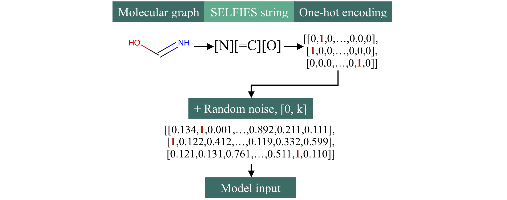

# Pasithea

This repository contains code for Pasithea, a gradient-based method for property optimization on molecules (or, if you will, a way to dream up molecules). See the corresponding scientific paper: [Deep Molecular Dreaming: Inverse machine learning for de-novo molecular design and interpretability with surjective representations](https://arxiv.org/abs/2012.09712)

At the core of model is a simple fully-connected neural network. The method outputs continuous, valid molecular transformations, which is enabled by these additions:
* [Self-referencing embedded strings (SELFIES)](https://github.com/aspuru-guzik-group/selfies), a surjective representation for molecular graphs.
* Random noise in molecular inputs. Every zero in the one-hot encoding is replaced with a random decimal in the range [0, k], where k is a specified upperbound.

At a high-level, there are two main steps:
1. Train the neural network on one-hot encoded SELFIES inputs and continuous logP outputs.
2. Inverse-train the neural network. Given a single logP and a single molecule, the network generates molecular variants that are optimized toward the logP value. The weights and biases remain fixed.

### Usage
The provided script `demo.py` may be used to view some molecular transformations and logP optimization from a subset of the QM9 dataset. `settings.yml` contains hyperparameters and other settings you may tweak, such as the learning rate and target logP. Note that the model is saved each time and if a model has already been trained with those hyperparameters, `demo.py` will load the existing model.
You may also test individual molecules by specifying them in `settings.yml` and running `test_mols.py`.

All questions and comments are welcome.

### References
[1] Cynthia Shen, Mario Krenn, Sagi Eppel, and Alan Aspuru-Guzik. [Deep Molecular Dreaming: Inverse machine learning for de-novo molecular design and interpretability with surjective representations](https://arxiv.org/abs/2012.09712), *Machine Learning: Science and Technology* **2**, 03LT02 (2021).

[2] Mario Krenn, Florian Häse, AkshatKumar Nigam, Pascal Friederich, and Alan Aspuru-Guzik. [Self-Referencing Embedded Strings (SELFIES): A 100% robust molecular string representation](https://iopscience.iop.org/article/10.1088/2632-2153/aba947), *Machine Learning: Science and Technology* **1**(5), 045024 (2020).
