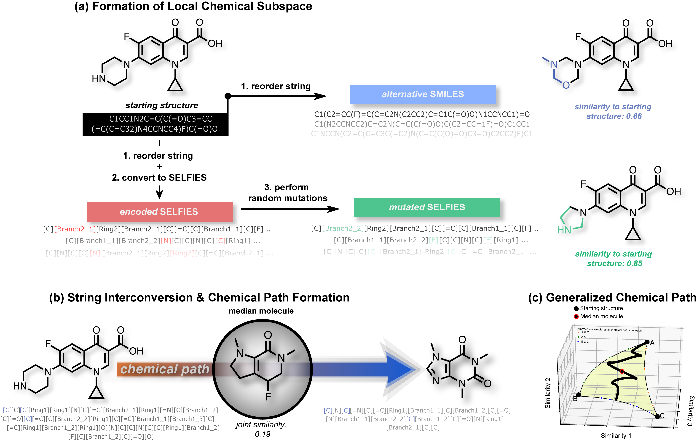

# STONED-SELFIES
This repository contains code for the paper: [Beyond Generative Models: Superfast Traversal, Optimization, Novelty, Exploration and Discovery (STONED) Algorithm for Molecules using SELFIES](https://chemrxiv.org/articles/preprint/Beyond_Generative_Models_Superfast_Traversal_Optimization_Novelty_Exploration_and_Discovery_STONED_Algorithm_for_Molecules_using_SELFIES/13383266). 
By: AkshatKumar Nigam, Robert Pollice, Mario Krenn, Gabriel dos Passos Gomes, Alán Aspuru-Guzik

## Prerequisites: 
For cloning the repository, please have a look at the Branch Navigator section.  

Before running the code, please ensure you have the following:
- [SELFIES (any version)](https://github.com/aspuru-guzik-group/selfies) - 
  The code was run with v1.0.1. The code is compatible with all v1+. 
- [RDKit](https://www.rdkit.org/docs/Install.html)
- [Python 3.0 or up](https://www.python.org/download/releases/3.0/)
- [numpy](https://pypi.org/project/numpy/)

## Experiment Navigator: 
- Please have a look at our [Tutorial Document](https://github.com/aspuru-guzik-group/stoned-selfies/blob/main/stoned_selfies_tut.ipynb). There we provide quick details on how to form local chemical subspaces, generating chemical paths & obtaining median molecules. 
- [Experiment B:](https://github.com/aspuru-guzik-group/stoned-selfies/blob/main/sim_search.py) Formation of Local Chemical Spaces 
- [Experiment C:](https://github.com/aspuru-guzik-group/stoned-selfies/blob/main/GA_rediscover.py) Chemical Paths and Rediscovery (with a GA)
- [Experiment D:](https://github.com/aspuru-guzik-group/stoned-selfies/blob/main/path_logP_QED.py) Interpolation via Chemical Path formation
- [Experiment E:](https://github.com/aspuru-guzik-group/stoned-selfies/blob/main/generalized_path.py) Median Molecules for Photovoltaics (obtaining median molecules)

## Questions, problems?
Make a github issue 😄. Please be as clear and descriptive as possible. Please feel free to reach
out in person: (akshat[DOT]nigam[AT]mail[DOT]utoronto[DOT]ca, rob[DOT]pollice[AT]utoronto[DOT]ca, mario[DOT]krenn[AT]utoronto[DOT]ca  , gabriel[DOT]gomes[AT]utoronto[DOT]ca)

## License

[Apache License 2.0](https://choosealicense.com/licenses/apache-2.0/)
