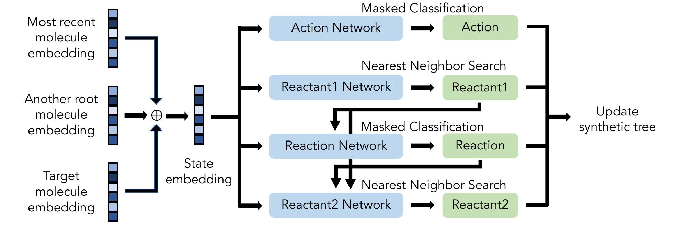

# SynNet
This repo contains the code and analysis scripts for our amortized approach to synthetic tree generation using neural networks. Our model can serve as both a synthesis planning tool and as a tool for synthesizable molecular design.

The method is described in detail in the publication "Amortized tree generation for bottom-up synthesis planning and synthesizable molecular design" available on the [arXiv](https://arxiv.org/abs/2110.06389) and summarized below.

## Summary
### Overview
We model synthetic pathways as tree structures called *synthetic trees*. A valid synthetic tree has one root node (the final product molecule) linked to purchasable building blocks (encoded as SMILES strings) via feasible reactions according to a list of discrete reaction templates (examples of templates encoded as SMARTS strings in [data/rxn_set_hb.txt](./data/rxn_set_hb.txt)). At a high level, each synthetic tree is constructed one reaction step at a time in a bottom-up manner, starting from purchasable building blocks.

The model consists of four modules, each containing a multi-layer perceptron (MLP): 

1. An *Action Type* selection function that classifies action types among the four possible actions (“Add”, “Expand”, “Merge”, and “End”) in building the synthetic tree.
2. A *First Reactant* selection function that predicts an embedding for the first reactant. A candidate molecule is identified for the first reactant through a k-nearest neighbors (k-NN) search from the list of potential building blocks.
3. A *Reaction* selection function whose output is a probability distribution over available reaction templates, from which inapplicable reactions are masked (based on reactant 1) and a suitable template is then sampled using a greedy search.
4. A *Second Reactant* selection function that identifies the second reactant if the sampled template is bi-molecular. The model predicts an embedding for the second reactant, and a candidate is then sampled via a k-NN search from the masked set of building blocks.



These four modules predict the probability distributions of actions to be taken within a single reaction step, and determine the nodes to be added to the synthetic tree under construction. All of these networks are conditioned on the target molecule embedding.

### Synthesis planning
This task is to infer the synthetic pathway to a given target molecule. We formulate this problem as generating a synthetic tree such that the product molecule it produces (i.e., the molecule at the root node) matches the desired target molecule.

For this task, we can take a molecular embedding for the desired product, and use it as input to our model to produce a synthetic tree. If the desired product is successfully recovered, then the final root molecule will match the desired molecule used to create the input embedding. If the desired product is not successully recovered, it is possible the final root molecule may still be *similar* to the desired molecule used to create the input embedding, and thus our tool can also be used for *synthesizable analog recommendation*.


### Synthesizable molecular design
This task is to optimize a molecular structure with respect to an oracle function (e.g. bioactivity), while ensuring the synthetic accessibility of the molecules. We formulate this problem as optimizing the structure of a synthetic tree with respect to the desired properties of the product molecule it produces.

To do this, we optimize the molecular embedding of the molecule using a genetic algorithm and the desired oracle function. The optimized molecule embedding can then be used as input to our model to produce a synthetic tree, where the final root molecule corresponds to the optimized molecule.

## Setup instructions

### Setting up the environment
You can use conda to create an environment containing the necessary packages and dependencies for running SynNet by using the provided YAML file:

```
conda env create -f environment.yml
```

If you update the environment and would like to save the updated environment as a new YAML file using conda, use:

```
conda env export > path/to/env.yml
```

### Unit tests
To check that everything has been set-up correctly, you can run the unit tests from within the [tests/](./tests/). If starting in the main SynNet/ directory, you can run the unit tests as follows:

```
source activate synthenv
export PYTHONPATH=`pwd`:$PYTHONPATH
cd tests/
python -m unittest
```

You should get no errors if everything ran correctly.

### Data

#### Templates
The Hartenfeller-Button templates are available in the [./data/](./data/) directory.
#### Building blocks
The Enamine data can be freely downloaded from https://enamine.net/building-blocks/building-blocks-catalog for academic purposes. After downloading the Enamine building blocks, you will need to replace the paths to the Enamine building blocks in the code. This can be done by searching for the string "enamine".

## Code Structure
The code is structured as follows:

```
SynNet/
├── data
│   └── rxn_set_hb.txt
├── environment.yml
├── LICENSE
├── README.md
├── scripts
│   ├── compute_embedding_mp.py
│   ├── compute_embedding.py
│   ├── generation_fp.py
│   ├── generation.py
│   ├── gin_supervised_contextpred_pre_trained.pth
│   ├── _mp_decode.py
│   ├── _mp_predict_beam.py
│   ├── _mp_predict_multireactant.py
│   ├── _mp_predict.py
│   ├── _mp_search_similar.py
│   ├── _mp_sum.py
│   ├── mrr.py
│   ├── optimize_ga.py
│   ├── predict-beam-fullTree.py
│   ├── predict_beam_mp.py
│   ├── predict-beam-reactantOnly.py
│   ├── predict_mp.py
│   ├── predict_multireactant_mp.py
│   ├── predict.py
│   ├── read_st_data.py
│   ├── sample_from_original.py
│   ├── search_similar.py
│   ├── sketch-synthetic-trees.py
│   ├── st2steps.py
│   ├── st_split.py
│   └── temp.py
├── syn_net
│   ├── data_generation
│   │   ├── check_all_template.py
│   │   ├── filter_unmatch.py
│   │   ├── __init__.py
│   │   ├── make_dataset_mp.py
│   │   ├── make_dataset.py
│   │   ├── _mp_make.py
│   │   ├── _mp_process.py
│   │   └── process_rxn_mp.py
│   ├── __init__.py
│   ├── models
│   │   ├── act.py
│   │   ├── mlp.py
│   │   ├── prepare_data.py
│   │   ├── rt1.py
│   │   ├── rt2.py
│   │   └── rxn.py
│   └── utils
│       ├── data_utils.py
│       ├── ga_utils.py
│       ├── predict_beam_utils.py
│       ├── predict_utils.py
│       └── __init__.py
└── tests
    ├── create-unittest-data.py
    └── test_DataPreparation.py
```

The model implementations can be found in [syn_net/models/](syn_net/models/), with processing and analysis scripts located in [scripts/](./scripts/). 

## Instructions
Before running anything, you need to add the root directory to the Python path. One option for doing this is to run the following command in the root `SynNet` directory:

```
export PYTHONPATH=`pwd`:$PYTHONPATH
```

## Using pre-trained models
We have made available a set of pre-trained models at the following [link](https://figshare.com/articles/software/Trained_model_parameters_for_SynNet/16799413). The pretrained models correspond to the Action, Reactant 1, Reaction, and Reactant 2 networks, trained on the Hartenfeller-Button dataset using radius 2, length 4096 Morgan fingerprints for the molecular node embeddings, and length 256 fingerprints for the k-NN search. For further details, please see the publication.

The models can be uncompressed with:
```
tar -zxvf hb_fp_2_4096_256.tar.gz
```

### Synthesis Planning
To perform synthesis planning described in the main text:
```
python predict_multireactant_mp.py -n -1 --ncpu 36 --data test
``` 
This script will feed a list of molecules from the test data and save the decoded results (predicted synthesis trees) to [./results/](./results/). 
One can use --help to see the instruction of each argument.
Note: this file reads parameters from a directory, please specify the path to parameters previously.

### Synthesizable Molecular Design
To perform synthesizable molecular design, under [./scripts/](./scripts/), run:
```
optimize_ga.py -i path/to/zinc.csv --radius 2 --nbits 4096 --num_population 128 --num_offspring 512 --num_gen 200 --ncpu 32 --objective gsk
```
This script uses a genetic algorithm to optimize molecular embeddings and returns the predicted synthetic trees for the optimized molecular embedding.
One can use --help to see the instruction of each argument.
If user wants to start from a checkpoint of previous run, run:
```
optimize_ga.py -i path/to/population.npy --radius 2 --nbits 4096 --num_population 128 --num_offspring 512 --num_gen 200 --ncpu 32 --objective gsk --restart
```
Note: the input file indicated by -i contains the seed molecules in CSV format for an initial run, and as a pre-saved numpy array of the population for restarting the run.

### Train the model from scratch
Before training any models, you will first need to preprocess the set of reaction templates which you would like to use. You can use either a new set of reaction templates, or the provided Hartenfeller-Button (HB) set of reaction templates (see [data/rxn_set_hb.txt](data/rxn_set_hb.txt)). To preprocess a new dataset, you will need to:
1. Preprocess the data to identify applicable reactants for each reaction template
2. Generate the synthetic trees by random selection
3. Split the synthetic trees into training, testing, and validation splits
4. Featurize the nodes in the synthetic trees using molecular fingerprints
5. Prepare the training data for each of the four networks

Once you have preprocessed a training set, you can begin to train a model by training each of the four networks separately (the *Action*, *First Reactant*, *Reaction*, and *Second Reactant* networks).

After training a new model, you can then use the trained model to make predictions and construct synthetic trees for a list given set of molecules.

You can also perform molecular optimization using a genetic algorithm.

Instructions for all of the aforementioned steps are described in detail below.

In addition to the aforementioned types of jobs, we have also provide below instructions for (1) sketching synthetic trees and (2) calculating the mean reciprocal rank of reactant 1.

### Processing the data: reaction templates and applicable reactants

Given a set of reaction templates and a list of buyable building blocks, we first need to assign applicable reactants for each template. Under [./syn_net/data_generation/](./syn_net/data_generation/), run:

```
python process_rxn_mp.py
```

This will save the reaction templates and their corresponding building blocks in a JSON file. Then, run:

```
python filter_unmatch.py 
```

This will filter out buyable building blocks which didn't match a single template.

### Generating the synthetic path data by random selection
Under [./syn_net/data_generation/](./syn_net/data_generation/), run:

```
python make_dataset_mp.py
```

This will generate synthetic path data saved in a JSON file. Then, to make the dataset more pharmaceutically revelant, we can change to [./scripts/](./scripts/) and run:

```
python sample_from_original.py 
```

This will filter out the samples where the root node QED is less than 0.5, or randomly with a probability less than 1 - QED/0.5.

### Splitting data into training, validation, and testing sets, and removing duplicates
Under [./scripts/](./scripts/), run:

```
python st_split.py
```

The default split ratio is 6:2:2 for training, validation, and testing sets.

### Featurizing data
Under [./scripts/](./scripts/), run:

```
python st2steps.py -r 2 -b 4096 -d train
```

This will featurize the synthetic tree data into step-by-step data which can be used for training. The flag *-r* indicates the fingerprint radius, *-b* indicates the number of bits to use for the fingerprints, and *-d* indicates which dataset split to featurize. 

### Preparing training data for each network
Under [./syn_net/models/](./syn_net/models/), run:

```
python prepare_data.py --radius 2 --nbits 4096
```

This will prepare the training data for the networks.

Each is a training script and can be used as follows (using the action network as an example):

```
python act.py --radius 2 --nbits 4096
```

This will train the network and save the model parameters at the state with the best validation loss in a logging directory, e.g., **`act_hb_fp_2_4096_logs`**. One can use tensorboard to monitor the training and validation loss.

### Sketching synthetic trees
To visualize the synthetic trees, run:

```
python scripts/sketch-synthetic-trees.py --file /path/to/st_hb/st_train.json.gz --saveto ./ --nsketches 5 --actions 3
```

This will sketch 5 synthetic trees with 3 or more actions to the current ("./") directory (you can play around with these variables or just also leave them out to use the defaults).

### Testing the mean reciprocal rank (MRR) of reactant 1
Under [./scripts/](./scripts/), run:

```
python mrr.py --distance cosine
```
